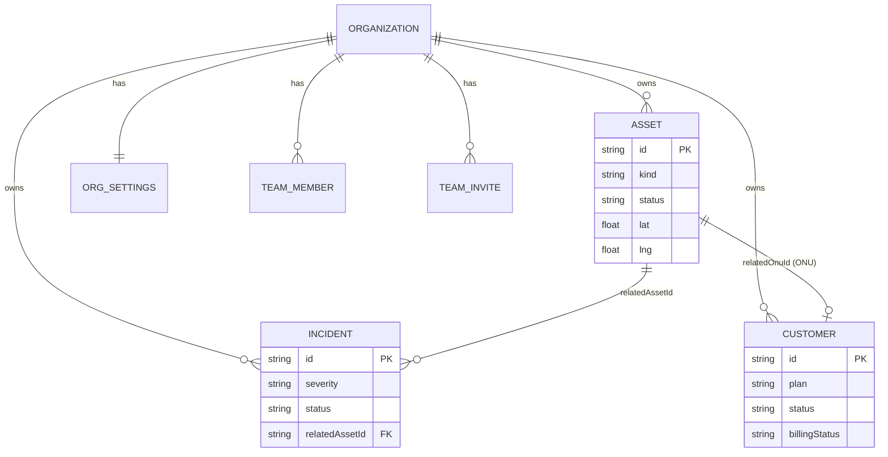

# Domain Models

Canonical TypeScript definitions live in `src/types/domain.ts`. Network map view models live in `src/modules/network-map/types.ts`. This document describes entities, enums, relationships, and business rules for backend implementation.

## Core entities

### Asset

Physical or logical network infrastructure element.

```typescript
type Asset = {
  id: string;
  kind: AssetKind;
  name: string;
  status: AssetStatus;
  location: { lat: number; lng: number };
};
```

| Field | Type | Required | Notes |
|-------|------|----------|-------|
| `id` | string | yes | Unique within org |
| `kind` | AssetKind | yes | See enum below |
| `name` | string | yes | Display name |
| `status` | AssetStatus | yes | Operational state |
| `location.lat` | number | yes | -90 to 90 |
| `location.lng` | number | yes | -180 to 180 |

**AssetKind:** `pole` | `junction_box` | `splitter` | `onu` | `pop` | `fiber_route`

**AssetStatus:** `active` | `degraded` | `down` | `maintenance`

**Relationships:**

- Incidents may reference an asset via `relatedAssetId`
- Customers may reference an ONU via `relatedOnuId` → `Asset.id` where `kind = onu`
- Topology generation links assets by spatial proximity (client-side today)

---

### Customer

Subscriber account tied to a service plan and optional ONU.

```typescript
type Customer = {
  id: string;
  name: string;
  plan: string;
  status: CustomerStatus;
  billingStatus: BillingStatus;
  relatedOnuId?: string;
  email?: string;
  notes?: string;
  location?: { lat: number; lng: number };
  createdAt: string;   // ISO 8601
  updatedAt: string;   // ISO 8601
};
```

| Field | Type | Required | Notes |
|-------|------|----------|-------|
| `plan` | enum string | yes | See allowed plans below |
| `status` | CustomerStatus | yes | Connectivity health |
| `billingStatus` | BillingStatus | yes | Default `paid` on create (mock behavior) |
| `relatedOnuId` | string | no | FK to asset (`onu`) |
| `location` | LatLng | no | Used for map + path tracing |

**CustomerStatus:** `online` | `offline` | `unstable`

**BillingStatus:** `paid` | `overdue` | `unpaid`

**Allowed plans** (create/update validation):

- `Fiber 50Mbps`
- `Fiber 100Mbps`
- `Fiber 200Mbps`
- `Fiber 500Mbps`
- `Fiber 1Gbps`

**Business rules:**

- On `POST /api/customers`, set `billingStatus: "paid"` unless product rules differ
- `updatedAt` must change on every PATCH
- Empty string email on create → store as `undefined`

---

### Incident

Network issue tracked through resolution workflow.

```typescript
type Incident = {
  id: string;
  title: string;
  severity: IncidentSeverity;
  status: IncidentStatus;
  relatedAssetId?: string;
  technician?: string;
  notes?: string;
  resolutionNotes?: string;
  createdAt: string;
  updatedAt: string;
  resolvedAt?: string;
};
```

**IncidentSeverity:** `low` | `medium` | `high` | `critical`

**IncidentStatus:** `new` | `investigating` | `assigned` | `resolved`

**Status workflow:**

```
new → investigating → assigned → resolved
         ↑_______________|
         (updates may skip steps in mock; enforce in prod if needed)
```

**Business rules:**

- `POST /api/incidents` → initial status `new`; mock auto-assigns a technician (rotate from pool)
- Resolving via `PATCH` with `status: "resolved"`:
  - Requires `resolutionNotes` (min 10 characters) when using resolve flow
  - Sets `resolvedAt` and `updatedAt` to current time
  - Mock copies `resolutionNotes` into `notes`
- Frontend filters active incidents: `status !== "resolved"`

---

## Settings entities

### OrganizationSettings

```typescript
type OrganizationSettings = {
  organizationName: string;  // 2–100 chars
  supportEmail: string;      // valid email
};
```

### Integration

```typescript
type Integration = {
  id: IntegrationProviderId;
  name: string;
  description: string;
  status: IntegrationStatus;
  enabled: boolean;
  apiKeyMasked?: string;     // never return raw secrets
};

type IntegrationProviderId = "mapbox" | "slack" | "pagerduty" | "stripe";
type IntegrationStatus = "connected" | "disconnected" | "error";
```

**Provider-specific credentials** (stored encrypted server-side):

| Provider | Fields when enabling |
|----------|---------------------|
| `mapbox` | `apiKey` |
| `stripe` | `apiKey` (secret key) |
| `slack` | `webhookUrl` |
| `pagerduty` | `routingKey` |

PATCH body uses `IntegrationUpdateFormValues`: `{ enabled, apiKey?, webhookUrl?, routingKey? }`. If credentials already exist, omitting secret fields keeps existing values.

### OutboundWebhook

```typescript
type OutboundWebhook = {
  enabled: boolean;
  url: string;
  secretMasked?: string;
  events: WebhookEvent[];
};

type WebhookEvent =
  | "incident.created"
  | "incident.resolved"
  | "outage.detected"
  | "work_order.updated";
```

When enabling: require valid URL, at least one event, signing secret (min 8 chars) if none stored.

### BillingSettings

```typescript
type BillingSettings = {
  legalName: string;
  billingEmail: string;
  currency: "USD" | "EUR" | "GBP" | "CAD";
  taxId: string;
  invoiceDelivery: "email" | "portal";
  lastSyncedAt: string | null;
};

type BillingSettingsPayload = {
  settings: BillingSettings;
  stripe: {
    status: IntegrationStatus;
    enabled: boolean;
    apiKeyMasked?: string;
  };
};
```

`POST /api/settings/billing/sync` updates `lastSyncedAt` after Stripe sync (requires Stripe integration enabled).

### Team & access control

```typescript
type TeamRole = "admin" | "operator" | "viewer";

type TeamMember = {
  id: string;
  name: string;
  email: string;
  role: TeamRole;
  lastActiveAt: string;
};

type TeamInvite = {
  id: string;
  email: string;
  role: TeamRole;
  invitedAt: string;
};

type TeamSettings = {
  members: TeamMember[];
  invites: TeamInvite[];
};
```

| Role | Intended permissions |
|------|---------------------|
| `admin` | Full access including settings and billing |
| `operator` | Operations: incidents, customers, work orders |
| `viewer` | Read-only dashboards and reports |

---

## Network map view models (Phase 2 API)

The map uses richer types than REST assets. Backend may expose these directly later.

### NetworkNode

```typescript
enum NetworkNodeType {
  CORE_NODE, DISTRIBUTION_NODE, ACCESS_NODE, SPLITTER,
  CUSTOMER, POLE, JUNCTION_BOX, ONU, POP
}

enum NetworkStatus {
  ACTIVE, INACTIVE, WARNING, DEGRADED, ERROR
}

type NetworkNode = {
  id: string;
  name: string;
  type: NetworkNodeType;
  position: { lat: number; lng: number };
  status: NetworkStatus;
  capacity?: number;
  utilization?: number;       // 0–100
  connectedNodes?: string[];
  metadata?: Record<string, unknown>;
};
```

**Asset → NetworkNode mapping** (frontend):

| Asset kind | NetworkNodeType | AssetStatus → NetworkStatus |
|------------|-----------------|----------------------------|
| `pop` | POP | active→ACTIVE, degraded→WARNING, down→ERROR, maintenance→INACTIVE |
| `junction_box` | JUNCTION_BOX | same |
| `splitter` | SPLITTER | same |
| `onu` | ONU | same |
| `pole` | POLE | same |
| `fiber_route` | ACCESS_NODE | same |

**Customer → NetworkNode:** type `CUSTOMER`; status online→ACTIVE, offline→ERROR, unstable→WARNING.

### NetworkConnection

```typescript
enum ConnectionType {
  FIBER_ROUTE = "fiber_route",
  CUSTOMER_CONNECTION = "customer_connection"
}

type NetworkConnection = {
  id: string;
  sourceNodeId: string;
  targetNodeId: string;
  type: ConnectionType;
  status: NetworkStatus;
  bandwidth?: number;
  utilization?: number;
  route?: Array<{ lat: number; lng: number }>;
};
```

**Topology algorithm (current client logic):**

1. Connect each PoP to nearest junction box (`FIBER_ROUTE`)
2. Connect junction boxes to nearest splitters
3. Connect splitters to nearest poles
4. Connect each ONU to nearest pole
5. Connect each customer (with location) to nearest ONU (`CUSTOMER_CONNECTION`), or to `relatedOnuId` when set

Backend Phase 2 endpoint suggestion:

```
GET /api/network/topology
→ { nodes: NetworkNode[], connections: NetworkConnection[] }
```

---

## Entity relationship diagram



## Stats (dashboard)

`GET /api/stats/usage` returns time-series points for fiber usage chart:

```typescript
type UsageStatPoint = {
  label: string;   // e.g. "08:00"
  value: number;   // Mbps or utilization index
};
```

Returns 13 points (hourly buckets). Production backend should source from metrics store rather than random values.
