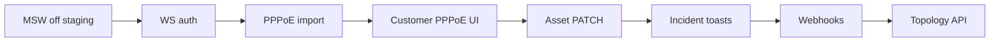

# Next Tasks Guideline

Prioritized backlog for continuing FiberOps backend + frontend integration after the initial Laravel API, auth, and Mikrotik real-time work.

Use this with:

- [Guideline](./guideline.md) — how to implement any feature end-to-end
- [Frontend Integration](./frontend-integration.md) — wiring the Next.js app to Laravel
- [WebSocket Protocol](./websocket-protocol.md) — real-time message contract

**Repos**

| Repo | Path | Role |
|------|------|------|
| Frontend | `FiberOps/` | Next.js UI, MSW contract, map |
| Backend | `Fiberops-backend/` | Laravel API, scheduler, WS gateway |

---

## Current baseline (done)

Use this as the starting line before picking new work.

| Area | Status |
|------|--------|
| Auth (Sanctum) | Login, register, logout, `/me` |
| Domain CRUD | Assets, customers, incidents, work orders, planning, reports, settings |
| Mikrotik integration | PPPoE sync, interface stats, netwatch → Redis → WebSocket |
| WebSocket gateway | Redis fan-out, protocol-aligned heartbeats + `status_broadcast` |
| Frontend live mode | Rewrites to Laravel when `NEXT_PUBLIC_USE_MSW=false` |
| Settings UI | Mikrotik card with test connection |
| Credential storage | Mikrotik password encrypted at rest |

---

## How to pick up a task

1. **Read the contract first** — `src/types/domain.ts`, `src/mocks/apiRouter.ts`, relevant Zod schema.
2. **Implement backend** in `Fiberops-backend/` (migration → model → controller → test).
3. **Verify frontend** — no UI change if the contract is unchanged; otherwise update types + hooks.
4. **Run checks**
   ```bash
   # Backend
   cd Fiberops-backend && php artisan test

   # Frontend (live mode)
   cd FiberOps
   # .env.local: NEXT_PUBLIC_USE_MSW=false, NEXT_PUBLIC_API_URL=http://localhost:8000
   npm run dev
   ```
5. **Update docs** — [API Reference](./api-reference.md), this file (mark done), [README](./README.md) status table.

---

## Priority 0 — Production readiness

Do these before exposing the app to real operators.

### P0-1 · Retire MSW in staging/production

**Goal:** All environments except local optional dev use Laravel.

**Steps**

1. Set in deployment env:
   ```env
   NEXT_PUBLIC_USE_MSW=false
   NEXT_PUBLIC_API_URL=https://api.your-domain.com
   NEXT_PUBLIC_WS_URL=wss://ws.your-domain.com/ws
   ```
2. Confirm Shell badge shows **Live API**, not **Mocked**.
3. Smoke-test: login → dashboard → network map → settings → customers.

**Acceptance:** No service worker intercepts `/api/*`; network tab shows Laravel host.

**Refs:** [Frontend Integration](./frontend-integration.md), `FiberOps/next.config.ts`

---

### P0-2 · WebSocket authentication + org scoping

**Goal:** Clients only receive events for their organization.

**Backend (`Fiberops-backend/ws-server/`)**

- Accept token on handshake (query `?token=` or `Sec-WebSocket-Protocol`).
- Validate Sanctum token; resolve `organization_id`.
- Subscribe client to `org:{orgId}:network` only (not global `psubscribe` fan-out to all).

**Frontend**

- Pass bearer token when opening WebSocket in `websocketService.ts`.

**Acceptance:** User A never sees org B status updates; invalid token rejected at connect.

**Refs:** [WebSocket Protocol — Authentication](./websocket-protocol.md#authentication)

---

### P0-3 · Import customers with PPPoE usernames

**Goal:** Map Mikrotik sessions to real subscriber list (not just seeder demo rows).

**Options (pick one)**

- **A.** CSV import endpoint: `POST /api/v1/customers/import` (columns: name, pppoeUsername, plan, …)
- **B.** One-time artisan command reading existing sheet format (`clientsSheetData` shape)
- **C.** Admin UI upload on customers page

**Acceptance:** ≥1 production PPPoE user toggles map node online/offline within one sync interval (~15s).

**Refs:** `FiberOps/src/mocks/clientsSheetData.ts`, `customers.pppoe_username` migration

---

### P0-4 · HTTPS and RouterOS hardening checklist

**Goal:** Safe Mikrotik connectivity in production.

**Router**

- [ ] Dedicated API user, read-only group
- [ ] REST enabled (RouterOS 7+) or classic API restricted by firewall
- [ ] Password rotated; stored only via Settings (encrypted in DB)

**Backend**

- [ ] `verifySsl=true` for production routers with valid certs
- [ ] `MIKROTIK_MOCK=false` in all non-dev envs
- [ ] Scheduler + WS services in compose/k8s (not only local Docker)

**Acceptance:** Test connection succeeds from staging; no plain-text router password in logs or API responses.

---

## Priority 1 — Operator experience

High value for day-to-day NOC use.

### P1-1 · Real-time incident UX

**Goal:** Netwatch/auto incidents surface immediately in UI.

**Done partially:** `incident_alert` invalidates incidents query.

**Remaining**

- Toast or banner on `incident_alert` in `useRealTimeUpdates.ts`
- Optional map overlay layer for active incidents (badge exists; geometry does not)
- Resolve flow should publish WS event or invalidate queries

**Acceptance:** Creating an incident (or netwatch down) updates incidents list without manual refresh.

---

### P1-2 · Customer edit: PPPoE username field

**Goal:** Operators can link customers to Mikrotik without DB access.

**Frontend:** Customer detail/create forms — field `pppoeUsername`.

**Backend:** Already supports `pppoeUsername` on PATCH/POST.

**Acceptance:** Edit customer in UI → sync reflects session match on next poll.

---

### P1-3 · Asset PATCH + monitor host on edit

**Goal:** Attach netwatch targets after asset creation.

**Backend:** Add `PATCH /api/v1/assets/:id` (status, monitorHost, name).

**Frontend:** Asset detail panel — edit monitor host; call PATCH.

**Acceptance:** Asset with `monitorHost` changes map color when netwatch flips.

---

### P1-4 · Outbound webhook dispatcher

**Goal:** Settings → Outbound Webhooks actually fires on events.

**Backend**

- Dispatcher service on incident create/resolve, work order update, netwatch outage
- HMAC signature header using configured secret
- Respect enabled + event filter from org settings

**Acceptance:** Request bin receives signed POST on `incident.created`.

**Refs:** `OrganizationSettingsService` webhook config, event list in settings schema

---

### P1-5 · Map usage dashboard from live Mikrotik data

**Goal:** Dashboard bandwidth chart shows non-flat lines when interface is configured.

**Verify**

- Mikrotik settings: `monitoredInterface` set (e.g. `ether1`)
- Scheduler running; Redis samples populated
- `GET /api/v1/stats/usage` returns recent `{ label, value }[]`

**Acceptance:** Chart updates over time; values change when traffic moves on router.

---

## Priority 2 — Architecture improvements

### P2-1 · Explicit topology API

**Goal:** Replace client-side `generateTopology` with backend graph.

**Backend:** `GET /api/v1/network/topology` → `{ nodes, connections }`

**Frontend:** Optional flag to use API graph when present, fallback to generated.

**Refs:** [Domain Models — Phase 2](./domain-models.md#network-map-view-models-phase-2-api), [Database Schema — topology](./database-schema.md#network-topology-phase-2--explicit-graph)

---

### P2-2 · Multi-router / multi-PoP Mikrotik

**Goal:** One org, many routers (e.g. one per PoP).

**Model:** `network_devices` table or credentials array keyed by `popId`

**Sync:** Poll each device; map sessions/assets by router id

---

### P2-3 · Shared domain package

**Goal:** Zero drift between frontend Zod and backend validation.

**Approach:** npm workspace or generated OpenAPI types from Laravel API resources.

**Refs:** [Guideline — Domain package](./guideline.md#step-2--domain-package)

---

### P2-4 · PostGIS + geo queries

**Goal:** Accurate proximity, coverage, and planning overlays.

**Backend:** Enable PostGIS; store `geography` on assets/customers; spatial indexes.

**Refs:** [Database Schema](./database-schema.md)

---

## Priority 3 — Nice to have

| Task | Notes |
|------|--------|
| `topology_snapshot` WS message | Full map state on reconnect |
| PPPoE flapping → `unstable` status | Debounce connect/disconnect within N minutes |
| RouterOS 6.43+ login challenge | Classic API on modern routers |
| Stripe / Slack / PagerDuty live calls | Integrations today are config-only |
| Audit log | Who changed asset status, integration credentials |
| E2E tests | Playwright: login → map WS update with mock Redis publish |

---

## Suggested sprint order



**Recommended next sprint (1–2 weeks):** P0-1 → P0-2 → P0-3 → P1-2

---

## Task template (copy for issues/PRs)

```markdown
## Task: [ID] Title

**Priority:** P0 | P1 | P2
**Repos:** FiberOps | Fiberops-backend | both

### Goal
One sentence outcome.

### Contract
- Types: `src/types/domain.ts` → ...
- API: `GET/PATCH ...` → shape ...

### Implementation checklist
- [ ] Migration / model
- [ ] Controller + validation
- [ ] Feature test
- [ ] Frontend hook (if needed)
- [ ] Docs updated

### Acceptance criteria
- [ ] ...
- [ ] `php artisan test` green
- [ ] Manual test with `NEXT_PUBLIC_USE_MSW=false`

### References
- docs/backend/...
```

---

## Keeping this doc current

When you **complete** a task:

1. Move it from the priority section to **Current baseline (done)** or delete if redundant.
2. Update [README implementation status](./README.md#implementation-status-frontend-expectations).
3. Note any contract change in [API Reference](./api-reference.md).

When you **add** a task:

- Assign P0–P3, link to contract files, define acceptance criteria.
- Prefer tasks that unlock operator value or remove mock/debt before new features.
